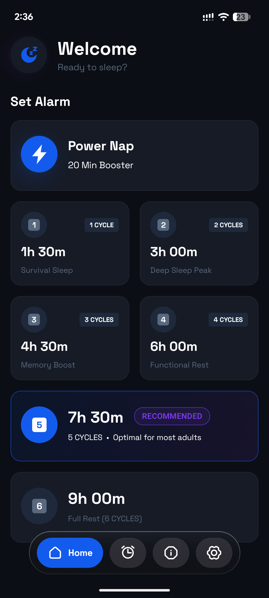
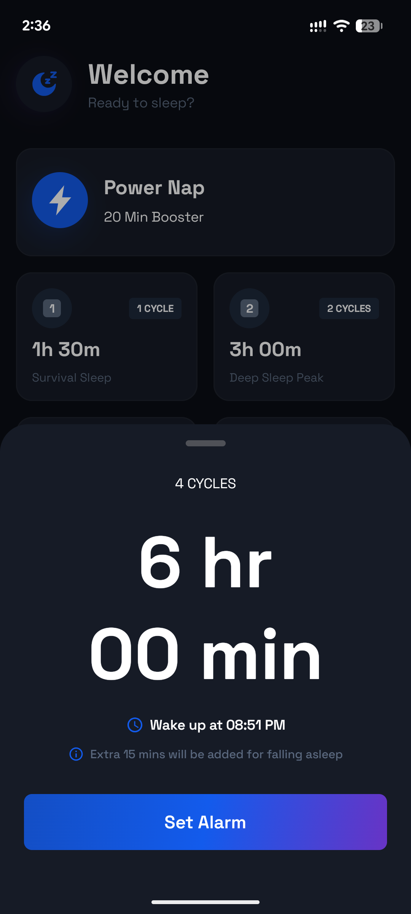
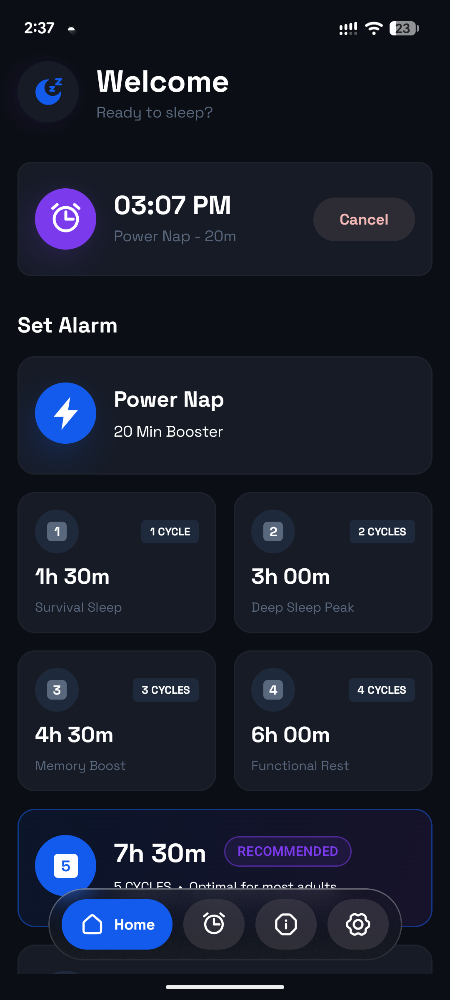
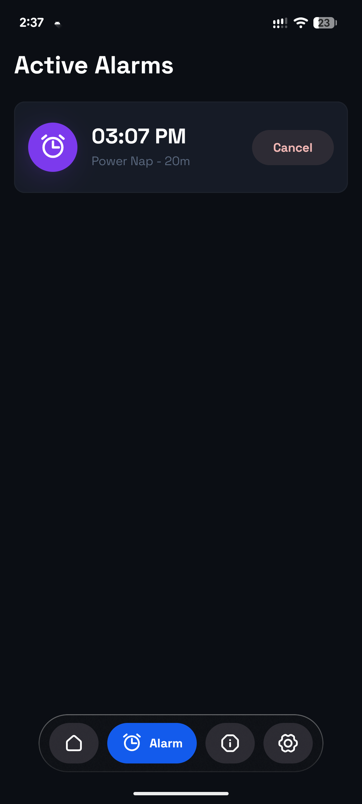
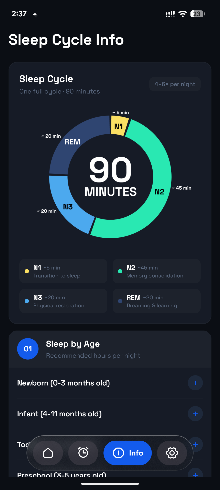
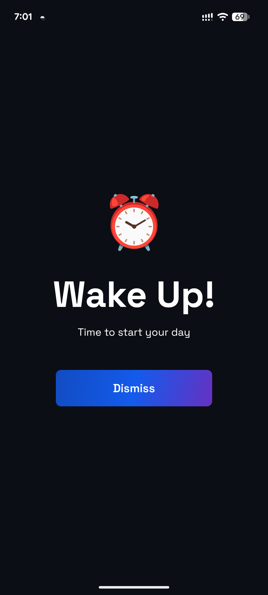

# SleepCycle

Sleep Cycle is a simple and elegant alarm application designed to help you wake up at the optimal time according to your sleep cycles, ensuring you feel refreshed after every nap.

## 📸 Screenshots

<div align="center">
  
  
  
  
  
  
</div>

## ✨ Key Features

- **Optimal Wake-up Times:** Calculates the best time to wake up based on 90-minute sleep cycles.
- **Simple UI:** Clean and modern interface built with Jetpack Compose.
- **Haze Effect:** Beautiful glassmorphism effects using the Haze library.
- **Efficient Alarms:** Easily set alarms for naps or a full night's sleep.

## 🛠️ Built With

- **UI:** [Jetpack Compose](https://developer.android.com/jetpack/compose) - Modern Android toolkit for building native UI.
- **Architecture:** MVVM (Model-View-ViewModel) with Clean Architecture principles.
- **Dependency Injection:** [Hilt](https://developer.android.com/training/dependency-injection/hilt-android) - Standard library for DI in Android.
- **Database:** [Room](https://developer.android.com/training/data-storage/room) - Robust local data storage.
- **Language:** [Kotlin](https://kotlinlang.org/) - 100% Kotlin based.
- **Version Support:** Android 7.0 (API 24) to Android 15 (API 35/36).

## 📁 Project Structure

```text
app/src/main/java/com/whitespace/sleepcycle/
├── core/           # Core components and base classes
├── data/           # Data layer (Room, Repositories, Preferences)
├── di/             # Hilt Dependency Injection modules
├── domain/         # Domain layer (Entities, Models)
├── presentation/   # UI Layer (Screens, ViewModels, Components)
│   ├── screens/    # Individual screen implementations
│   └── components/ # Reusable Compose components
├── ui/             # Theme, Colors, Typography, and Font styling
└── utils/          # Utility functions and extensions
```

## 🚀 Get the App

The application is live on Google Play Store.  
[https://play.google.com/store/apps/details?id=com.whitespace.sleepcycle](https://play.google.com/store/apps/details?id=com.whitespace.sleepcycle)
